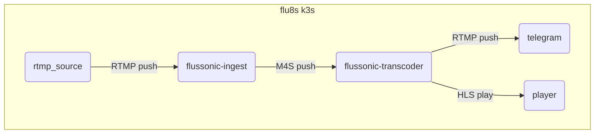

This example is just a demostration how to run trivial Flussonic cluster in [k3s](https://docs.k3s.io/quick-start).

**Prerequisites**
* Docker installed and k3s installed
```
curl -sfL https://get.k3s.io | sh -
mkdir /root/.kube
cp /etc/rancher/k3s/k3s.yaml /root/.kube/config
```

**Video pipeline:**


**Description:**
* Start stream publishing via RTMP to `flussonic-ingest`:
```
rtmp://my.domain.com:1935/static/{stream_name}
```
* `flussonic-ingest` gets stream configuration from `config-app` using [config_external](https://flussonic.com/doc/api/config-external/#tag/stream/operation/streams_list/response%7Cstreams) and starts publishing to telegram via RTMP and `flussonic-transcoder` via M4S.
* `flussonic-transcoder` transcodes input RTMP into 3 renditions for stream.
* Viewer can play MBR stream (via HLS or other protocols):
```
http://my.domain.com:8282/{stream_name}/index.m3u8
```

**How to run it**

* Edit `flussonic-secrets.yaml`. Put your Flussonic license key, edit auth and RTMP endpoint.
* Edit `flussonic-ingress.yaml`. Put real domain name of your server into .spec.rules.host.
* Run cluster:
```
bash start.sh
```
* stop cluster:
```
bash stop.sh
```
* `config-app` is a trivial flask app which returns Flussonic stream configuration. You can build container:
```
cd
docker build -t config-app:1.0 .
```

**TODO:**
Figure out with SRT.